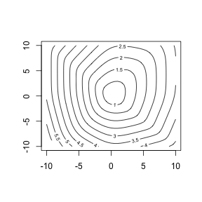

Tarea 1: Regresión logística y regularización 
=============================================

En esta tarea se construyen predicciones basadas en regresión logística
regularizada, usando máximo descenso para ajustar los modelos.

## Ejercicio 1
En primer lugar, implementa la inversa de la función logística en `logit.R`, dada por $g(x) = \frac{1}{1+e^{-x}}$. 

Debes obtener:


```r
source("funciones/logit.R")
g(0)
```

```
## [1] 0.5
```

```r
g(-2)
```

```
## [1] 0.1192
```

```r
curve(g, from = -4, to = 4)
```

 


## Ejercicio 2

Recuerda que si

$$h_\theta(x) = g(\theta^T x)$$ 

entonces la pérdida está dada por:

$$J= - \frac{1}{N} \sum_{i=1}^N y^i log(h_\theta (x^i)) + (1-y^i)log(1-h_\theta(x^i)).$$

cuyo gradiente está dado por

$$ \frac{1}{N} \sum_{i=1}^N (h_\theta(x^i)-y^i)x^i_j$$


Implementa el cálculo de la función de pérdida $J$ en la funcion `J_perdida.R` , que toma como parámetros un vector de salida, una matriz de entradas, y devuelve una función que depende de $\theta$. Debes obtener:


```r
source("funciones/J_perdida.R")
y <- c(0, 1, 0, 0, 0, 0, 0, 1, 1)
X <- matrix(c(-1.5, 1, 1.2, 0, 0, 1, 0, 0, -2, -2, 1, -1, 1, 0, -1, 0, 0, 0), 
    ncol = 2, byrow = TRUE)
theta.0 <- c(-0.5, 1.2)
theta.1 <- c(-0.5, 0)
J <- J.perdida(y = y, X = X)
J(theta = theta.0)
```

```
## [1] 7.306
```

```r
J(theta = theta.1)
```

```
## [1] 6.989
```


Si graficamos esta función obtenemos:


```r
library(lattice)
theta_x <- seq(from = -10, to = 10, by = 0.5)
theta_y <- seq(from = -10, to = 10, by = 0.5)
J.1 <- function(x, y) {
    J(c(x, y))
}
grid <- expand.grid(x = theta_x, y = theta_y)
z <- (outer(theta_x, theta_y, Vectorize(J.1)))
contour(theta_x, theta_y, z, nlevels = 10)
```

 


## Ejercicio 3

Ahora implementamos el cálculo del gradiente para después usar descenso máximo. Escribe tu función en `gradiente.R`


```r
source("funciones/gradiente.R")
J.grad.1 <- J.grad(y, X)
J.grad.1(c(0, 0))
```

```
##          [,1]
## [1,] -0.09444
## [2,] -0.05556
```

```r
J.grad.1(c(-1, 0))
```

```
##          [,1]
## [1,] -0.34482
## [2,] -0.07922
```


## Ejercicio 4

Finalmente encontramos $\theta$ que minimiza la pérdida empírica. Usaremos la funcion `optim`


```r
resultado <- optim(c(0, 0), J)
resultado$par
```

```
## [1] 0.3027 0.2496
```

```r
contour(theta_x, theta_y, z, nlevels = 10)
points(resultado$par[1], resultado$par[2], col = "red", pch = 20)
```

 

